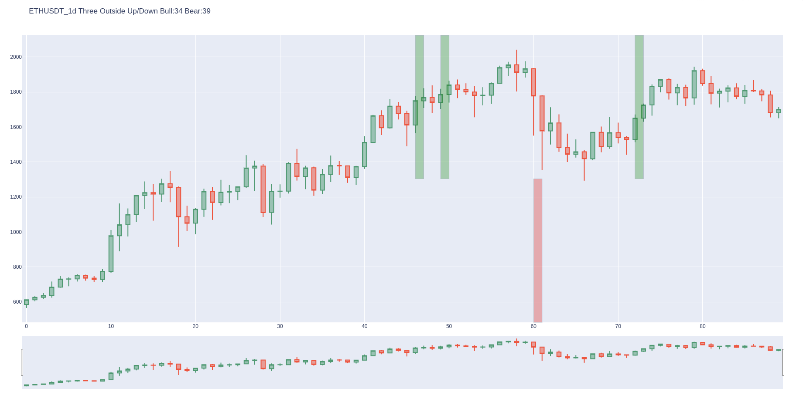
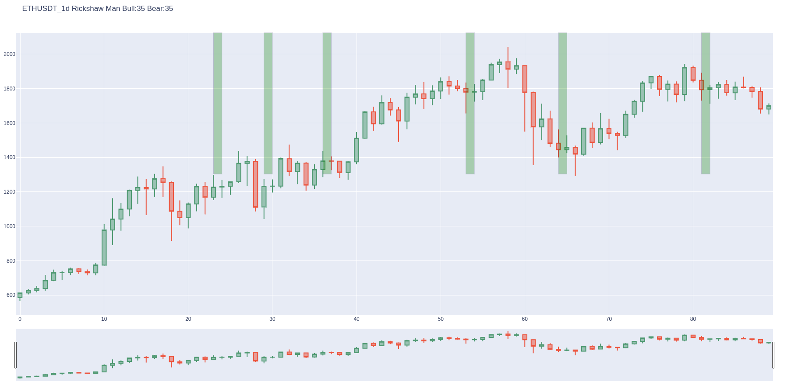

# Recognize Crypto Price Patterns

Usage:

```
python3 create.py ticker interval lastxDays recent

ticker: Ticker symbol (ETHUSDT, BTCETH etc.) works only with coins on Binance
interval: 1h - hourly, 4h - 4 hours, 1d - daily etc.
lastxDays: fetch data from last x days
recent: To see all patterns set this to "all". Otherwise, it will only display the patterns that recently appeared
```

Example:
```
python3 create.py ETHUSDT 1d 90
```
After executing the command all the graphs will be saved in a html file which you can find in the `./html` folder.  





The numbers after "Bull" and "Bear" represents the overall performance rank taken from http://thepatternsite.com/